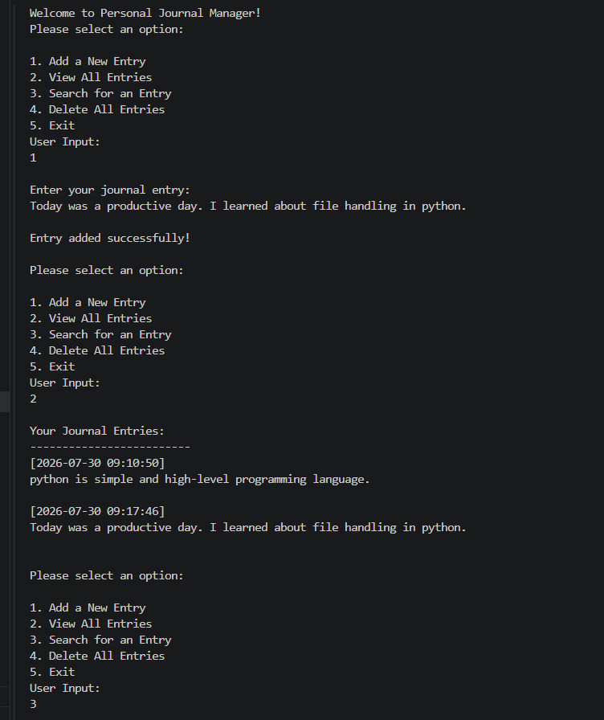
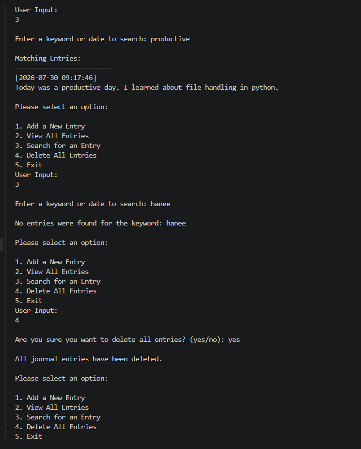
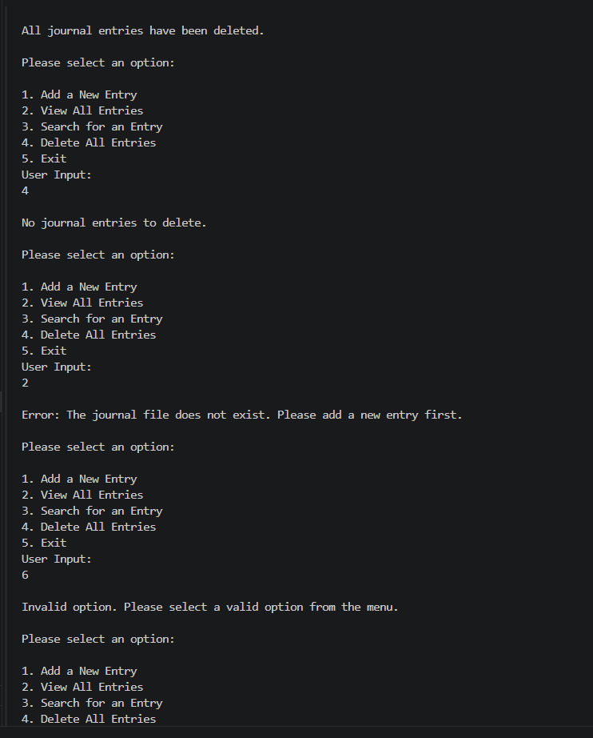
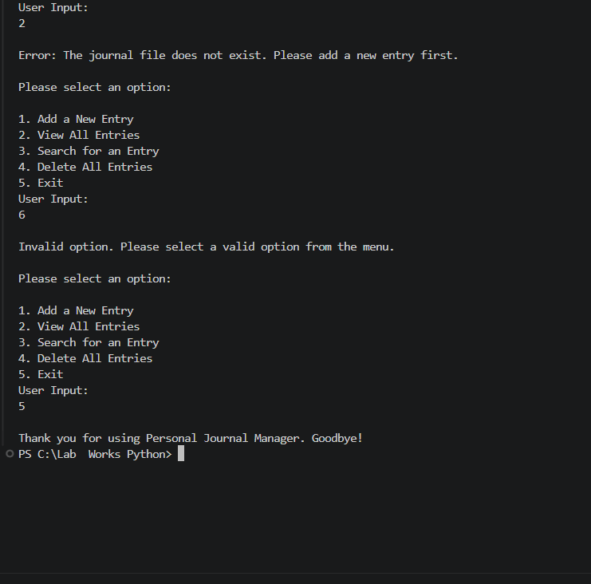

## 📖 PR6-Journal-Manager-Project

A menu-driven Python application that allows users to maintain a personal journal using text file handling. This project demonstrates File Handling, Exception Handling, and Object-Oriented Programming (OOP) concepts.

---

## 📌 Project Overview

The Personal Journal Manager enables users to:

- Add new journal entries
- View all saved entries
- Search entries using keywords 
- Delete all journal entries 

All journal entries are stored in a text file named **journal.txt** with a timestamp.

---

## ✨ Features

- 📝 Add New Journal Entry
- 📂 View All Journal Entries
- 🔍 Search Journal Entries
- 🗑 Delete All Entries
- ⏰ Automatic Timestamp
- 📄 Text File Storage
- ⚠ Exception Handling
- 📋 Menu-Driven Interface
- 🧑‍💻 Object-Oriented Programming (OOP)

---

## 🛠 Technologies Used

- Python 3
- Object-Oriented Programming (OOP)
- File Handling
- Exception Handling
- Date & Time Module
- OS Module

---

## 📂 Project Structure

```

├── PR6-Journal_Manager.py
├── journal.txt
├── README.md
```

---

## 📋 Menu Options

```
1. Add New Entry
2. View All Entries
3. Search for an Entry
4. Delete All Entries
5. Exit
```

---

## 📁 File Handling Modes Used

| Mode | Purpose |
|------|---------|
| r | Read journal entries |
| w | Create/Overwrite file |
| a | Append new entries |
| x | Create a new file if it does not exist |

---

## ⚠ Exception Handling

The project handles:

- FileNotFoundError
- PermissionError
- Invalid User Input
- Unexpected Errors

This ensures the program does not crash during execution.

---

## 🧑‍💻 OOP Concepts Used

- Class
- Object
- Instance Methods
- Encapsulation
- File Handling
- Exception Handling

---

## ▶ How to Run

1. Clone the repository.

```
git clone https://github.com/hanipatel2510/PR6-Journal-Manager-Project.git

```

2. Open the project folder.

3. Run the program.

```
PR6-Journal-Manager.py
```

---
# 💻 Sample Output







## Video Demonstration
video Link:[https://drive.google.com/file/d/1Heez3TyGlb5O8CCqu6xcvuZB3Ijlaf_R/view?usp=sharing]

## 📸 Sample Workflow

- Add a journal entry
- View all entries
- Search using a keyword
- Delete all entries with confirmation
- Exit the application

---

## 🎯 Learning Outcomes

This project demonstrates practical understanding of:

- Python File Handling
- Reading and Writing Files
- Exception Handling
- Object-Oriented Programming
- Menu-Driven Programs
- User Interaction

---
